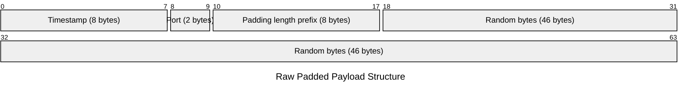
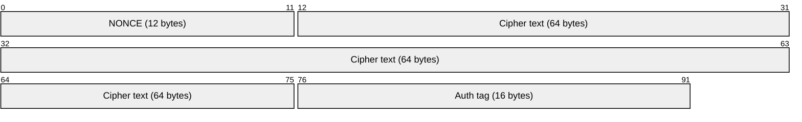

# SpectreGate - An asynchronous, zero-socket, stealth port authorisation tool written in Rust🦀 

## Architecture
### > Client Side
#### When the client creates a payload, It originally looks like this: 


#### But to prevent network fingerprinting, a padding of random bytes is added to make it of 64 bytes in size.



#### This packet is then encrypted using ChaCha20Poly1305 AEAD algorithm using a 32 bytes long key. After which, the transmission wire looks like:



### > Daemon Side
#### The daemon actively runs in userspace and sniffs for packets using libpcap and BPF loop. It acts as a passive tap on the network interface card (NIC) reading raw network layer frames. It slices open the frame to extract the IPv4 address, isolating UDP traffic header and the raw encrypted payload. It drops bad or invalid internet frames.
#### If the ciphertext is decrypted cleanly and the key is validated, the timestamp is compared to the set time drift i.e. 15 seconds and the nftables is modified and the port is accessible for a window of 10 seconds in which, the client can access it. 

## Safety measures
- Zero socket footprint: The Daemon doesn't bind to a socket to reduce exposure.
- Fixed size payload: Mitigates the risk of network fingerprinting.
- Stored NONCEs: Seen NONCEs are stored to prevent replay style attacks.

## Toolchain
### Rust
- Stable Rust Toolchain
- cargo and rustc

### Crate dependencies:
| Crate | Version | Specific Architectural Purpose |
| :--- | :--- | :--- |
| **`serde`** | `1.0` | Provides the serialization framework macros (`#[derive(Serialize, Deserialize)]`) for native Rust structures. |
| **`bincode`** | `1.3.3` | Handles compact, low-overhead binary encoding and decoding using explicit trailing byte tolerance configurations. |
| **`chrono`** | `0.4` | Manages real-time clock capturing and epoch validation formatting across both host nodes. |
| **`chacha20poly1305`** | `0.10` | Implements the Authenticated Encryption with Associated Data (AEAD) standard for tamper-proof data privacy. |
| **`tokio`** | `1.35` | Powers the asynchronous multi-threaded runtime engine, unlocking concurrent packet streaming pathways. |
| **`rand`** | `0.10.1` | Provides the cryptographically secure random number generation subsystem for nonces and payload obscuration padding. |
| **`clap`** | `4.6.1` | Parses declarative command-line inputs and parameters into typed configurations for the runtimes. |
| **`pcap`** | `2.4.0` | Interfaces directly with the system's low-level `libpcap` library to bind raw event-driven capture streams. |
| **`futures`** | `0.3` | Extends asynchronous primitive operations, allowing asynchronous streaming and packet iteration. |
| **`etherparse`** | `0.20.2` | Executes zero-copy network packet header slicing to extract inner Layer 4 data blocks with maximum efficiency. |
### System dependencies
- libpcap development headers
### Linux permissions
- CAP_NET_RAW and CAP_NET_ADMIN 
or
- Root privileges 

## Command line arguments
### Daemon binary
#### ```--interface```: Target network interface card name.
#### ```--port     ```: Port on which the BPF filter listens.
#### ```--key      ```: Path to the secret shared key.

### Client binary
#### ```--server   ```: The IP address of the destination host.
#### ```--port     ```: Designated UDP knocking port.
#### ```--open-port```: Port you want to unlock.
#### ```--key      ```: Path to the secret shared key.

## Test it yourself
#### Create the test environment: 
```bash
# Initializes an isolated 'client_ns' network namespace and veth pairs for testing
sudo bash ./test/test_env.sh
``` 
#### Run the target service (Host workspace)
```bash
nc -nvlp 22 -s 10.0.0.1
```
#### Run the daemon (Host workspace)
```bash
# Makes the 32 byte long secret key
dd if=/dev/urandom of=./secret.key bs=1 count=32 

# Run the daemon
sudo ./target/release/spectregate-daemon \
  --interface veth_server \
  --port 4192 \
  --key ./secret.key
```

#### Run and test with client
```bash 
# Send the knock to the daemon
sudo ip netns exec client_ns ./target/release/spectregate-client \
  --server 10.0.0.1 \
  --port 4192 \
  --open-port 22 \
  --key ./secret.key

# Test with nmap
sudo ip netns exec client_ns nmap -sU -sS -p U:4192,T:22 10.0.0.1
```
## Limitations
> Works only in IPv4 hosts
> Requires a properly configured ```nftables```.